# Tokinomo Platform — System Architecture

**Status:** Proposed · **Date:** 26 Jul 2026 · **Owner:** Manav (Baliyo Ventures)
**Scope:** Multi-tenant SaaS for a fleet of shelf-advertising robots.

> **Tenancy in one line:** Baliyo Ventures owns the platform (super admin);
> each brand (Xtreme today, cosmetics/others later) is a **tenant** that manages
> its own products, devices, audio, and analytics. Devices are provisioned by
> Baliyo and assigned to a tenant. Nothing is hardcoded to Xtreme.

---

## 1. Requirements & constraints

**Functional**
- Register/provision physical devices (ESP32-S3) and track online/offline health.
- Assign a device → tenant → store location → product.
- Ingest telemetry: detections, dwell time, audio plays, uptime.
- Push audio to one device or many, over the air.
- Multi-tenant dashboard: super-admin console + per-brand workspace.
- Role-based access; a brand only ever sees its own data.

**Non-functional**
- **Scale target (realistic):** 100 devices now → low-thousands across several brands. A device reports lightweight events, not video — modest data rates.
- **Small team**, tight sprint → favour a **modular monolith**, managed services, and boring, well-known tech over microservices.
- **Low recurring cost** (Wi-Fi only, no SIM) → self-hostable stack on a single VPS to start, clean path to scale out.
- Offline-tolerant firmware (shop Wi-Fi is flaky) → local buffering + reconnect.

---

## 2. System context

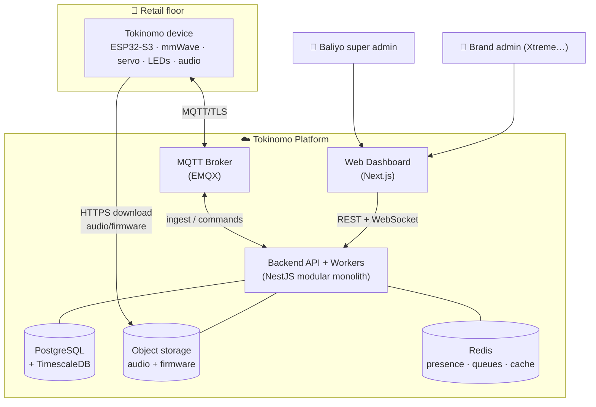

**Flow in words:** devices talk to an MQTT broker over TLS; the backend consumes
telemetry and issues commands through that broker; audio/firmware binaries are
pulled over HTTPS from object storage (keeps large payloads off MQTT); the
dashboard talks REST + WebSocket to the backend.

---

## 3. Multi-tenancy & access model

### 3.1 Tenant hierarchy

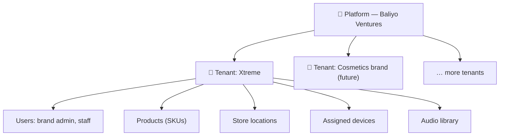

### 3.2 Roles (RBAC)

| Role | Belongs to | Can do |
|---|---|---|
| `PLATFORM_OWNER` | Baliyo | Everything, all tenants; create tenants; provision & assign devices; manage firmware |
| `PLATFORM_OPERATOR` | Baliyo | Support: view all tenants, re-assign devices, help onboard — no billing/destructive ops |
| `BRAND_ADMIN` | Tenant | Manage own users, products, locations, audio; view own devices & analytics; push audio |
| `BRAND_STAFF` | Tenant | Upload audio, view analytics — no user management |
| `BRAND_VIEWER` | Tenant | Read-only analytics |

**Device inventory** is owned by the platform. A device is `UNASSIGNED` until a
platform admin assigns it to a tenant — that's the moment it appears in the
brand's workspace.

### 3.3 Isolation strategy — **shared DB, shared schema, `tenant_id` + Postgres RLS**

**Tenant = BetterAuth organization.** The `tenant_id` on every domain row is the
BetterAuth `organizationId`; roles and memberships come from BetterAuth's
organization plugin, and Postgres RLS enforces isolation at the database as a
second line of defense.

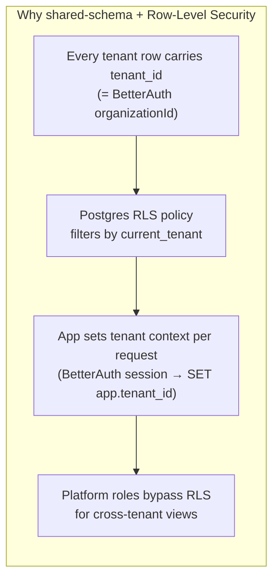

| Option | Verdict |
|---|---|
| **Shared schema + `tenant_id` + RLS** ✅ | Cheapest, simplest to operate, easy cross-tenant admin views. RLS gives defense-in-depth so a query bug can't leak across brands. **Chosen.** |
| Schema-per-tenant | More isolation, painful migrations across dozens of schemas. Overkill at this scale. |
| DB-per-tenant | Strongest isolation, highest ops cost. Revisit only for an enterprise brand with a contractual data-residency demand. |

---

## 4. Data model

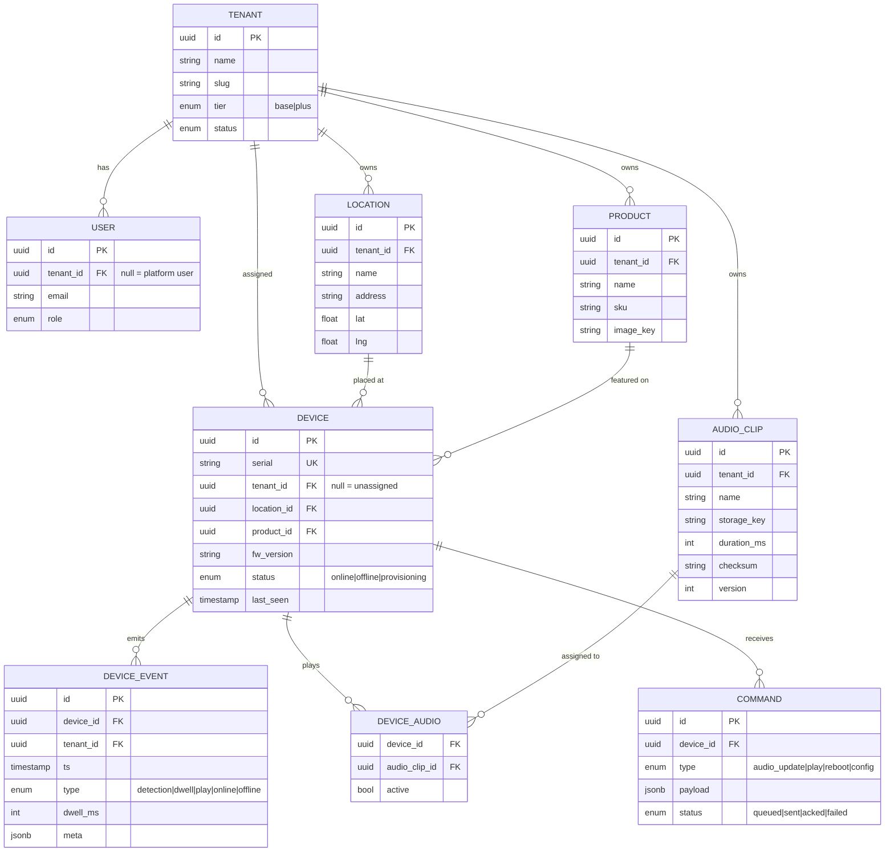

`DEVICE_EVENT` is a **TimescaleDB hypertable** (time-partitioned) with
continuous aggregates rolling up per-device/per-day counts for fast dashboards.

---

## 5. Backend

### 5.1 Stack

| Concern | Choice | Why |
|---|---|---|
| API framework | **NestJS (TypeScript)** | Team familiarity, modular structure, first-class DI, guards for RBAC/tenancy |
| ORM | **Prisma** | Type-safe schema + easy migrations (RLS added via SQL migration) |
| Database | **PostgreSQL + TimescaleDB** | One engine for relational + time-series telemetry; RLS for isolation |
| MQTT broker | **EMQX** | Per-device auth + topic ACL, retained messages, LWT, scales far beyond Mosquitto |
| Object storage | **S3-compatible** (MinIO self-host → Cloudflare R2/S3) | Audio & firmware binaries; signed URLs; keeps big files off MQTT |
| Cache / queue / presence | **Redis + BullMQ** | Device presence, background jobs (audio push, rollups), pub/sub → WebSocket |
| Realtime to UI | **WebSocket (Socket.IO) / SSE** | Live device status without polling |
| Auth & tenancy | **BetterAuth (organization plugin)** | Reuses the team's existing NestJS BetterAuth multi-tenant pattern; **organization = tenant**, with members, roles & invitations built in |
| Deploy | **Coolify + Docker** on a VPS | Self-hosted PaaS: git-push deploys, automatic TLS (Traefik), one-click Postgres/Redis; every service is a Docker resource |

### 5.2 Service / module breakdown (modular monolith)

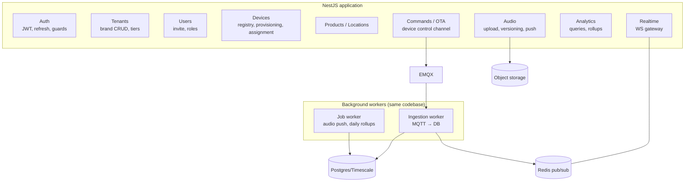

**Module responsibilities**
- **Auth** — **BetterAuth** (email/password + organization plugin) handles login, sessions, org membership, invitations, and roles; a thin `RolesGuard` + `TenantContextInterceptor` reads the BetterAuth session and sets `app.tenant_id` for RLS.
- **Tenants** — platform-only: create/suspend brands (= BetterAuth organizations), set tier (base/plus).
- **Users** — invite users into a tenant/org, assign roles (via BetterAuth org invitations).
- **Devices** — device inventory, provisioning tokens, assignment to tenant/location/product, lifecycle (`unassigned→provisioning→online/offline`).
- **Products / Locations** — tenant catalogue + store map.
- **Audio** — accept **pre-recorded clip uploads** (v1; no TTS), store in object storage, version + checksum, assign to devices, trigger push.
- **Commands / OTA** — enqueue commands, publish to device topic, track ack; firmware rollout.
- **Analytics** — read models over the telemetry hypertable + continuous aggregates.
- **Realtime** — WebSocket gateway; pushes live device status/events to the dashboard.
- **Ingestion worker** — subscribes to broker, validates, writes `DEVICE_EVENT`, updates presence in Redis + `last_seen`.
- **Job worker** — BullMQ jobs: fan-out audio push, nightly rollups, offline sweeps.

### 5.3 Repository structure

```
backend/
├─ src/
│  ├─ main.ts
│  ├─ app.module.ts
│  ├─ common/
│  │  ├─ guards/            # jwt.guard.ts, roles.guard.ts
│  │  ├─ interceptors/      # tenant-context.interceptor.ts
│  │  ├─ decorators/        # @Roles(), @CurrentTenant(), @CurrentUser()
│  │  └─ prisma/            # prisma.service.ts (sets RLS session var)
│  ├─ modules/
│  │  ├─ auth/
│  │  ├─ tenants/
│  │  ├─ users/
│  │  ├─ devices/
│  │  ├─ products/
│  │  ├─ locations/
│  │  ├─ audio/
│  │  ├─ commands/
│  │  ├─ analytics/
│  │  └─ realtime/
│  ├─ workers/
│  │  ├─ ingestion/         # mqtt consumer
│  │  └─ jobs/              # bullmq processors
│  └─ config/
├─ prisma/
│  ├─ schema.prisma
│  └─ migrations/           # includes RLS policy SQL
├─ test/
├─ docker-compose.yml       # postgres, emqx, redis, minio
└─ Dockerfile
```

### 5.4 Tenant isolation guard (representative code)

```typescript
// common/interceptors/tenant-context.interceptor.ts
@Injectable()
export class TenantContextInterceptor implements NestInterceptor {
  constructor(private prisma: PrismaService) {}

  async intercept(ctx: ExecutionContext, next: CallHandler) {
    const req = ctx.switchToHttp().getRequest();
    const session = req.session; // from BetterAuth (user + activeOrganizationId + role)

    // Platform roles see everything; brand roles are pinned to their org (tenant).
    const isPlatform = session.user.role?.startsWith('PLATFORM_');
    const tenantId = isPlatform
      ? (req.headers['x-tenant-id'] ?? null)          // platform impersonation
      : session.activeOrganizationId;                 // BetterAuth org = tenant

    // Bind the RLS session variable for this request's DB work.
    await this.prisma.$executeRawUnsafe(
      `SET app.tenant_id = '${tenantId ?? ''}';
       SET app.is_platform = '${isPlatform}';`,
    );
    return next.handle();
  }
}
```

```sql
-- prisma/migrations/xxxx_rls/migration.sql
ALTER TABLE device_event ENABLE ROW LEVEL SECURITY;
CREATE POLICY tenant_isolation ON device_event
  USING (
    current_setting('app.is_platform', true) = 'true'
    OR tenant_id = current_setting('app.tenant_id', true)::uuid
  );
-- repeat for product, location, device, audio_clip, users …
```

---

## 6. Device ↔ Cloud protocol (MQTT)

### 6.1 Topic design (tenant + device namespaced)

| Topic | Dir | Retained | Purpose |
|---|---|---|---|
| `t/{tenant}/d/{device}/status` | D→C | ✅ (LWT) | `online` / `offline` presence |
| `t/{tenant}/d/{device}/telemetry` | D→C | — | heartbeat, fw version, wifi rssi |
| `t/{tenant}/d/{device}/event` | D→C | — | detection / dwell / play events |
| `t/{tenant}/d/{device}/cmd` | C→D | — | play, config, `audio_update`, reboot |
| `t/{tenant}/d/{device}/ack` | D→C | — | command results |

**Auth & ACL:** each device gets **per-device credentials** (username = serial,
password = provisioning token) enforced by EMQX; an ACL restricts a device to
**only its own** `t/{tenant}/d/{device}/#` subtree — one device can never read or
write another brand's topics. Large payloads (audio) are **not** sent over
MQTT — the `audio_update` command carries a signed HTTPS URL + checksum.

### 6.2 Telemetry + command sequence

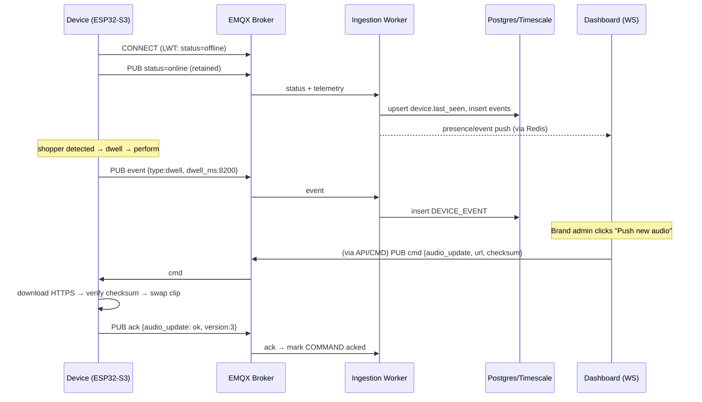

---

## 7. Device provisioning & OTA

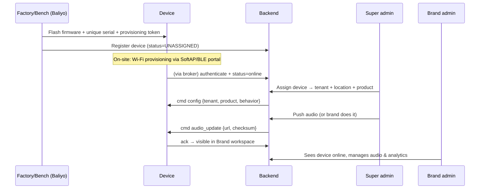

- **Wi-Fi onboarding:** SoftAP captive portal (or BLE) — installer picks the shop
  SSID and enters the password once; creds saved to NVS.
- **Firmware OTA:** `esp_https_ota` with **A/B partitions** (rollback on bad boot).
- **Audio OTA:** download to LittleFS, verify checksum, atomically switch active clip.

---

## 8. ESP32-S3 firmware architecture

**Framework:** Arduino-ESP32 via **PlatformIO** for sprint speed (path to ESP-IDF
later for production hardening). **FreeRTOS tasks** keep sensing, networking, and
performance independent so a Wi-Fi stall never freezes the interaction.

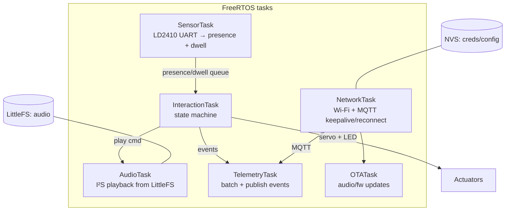

### 8.1 Interaction state machine

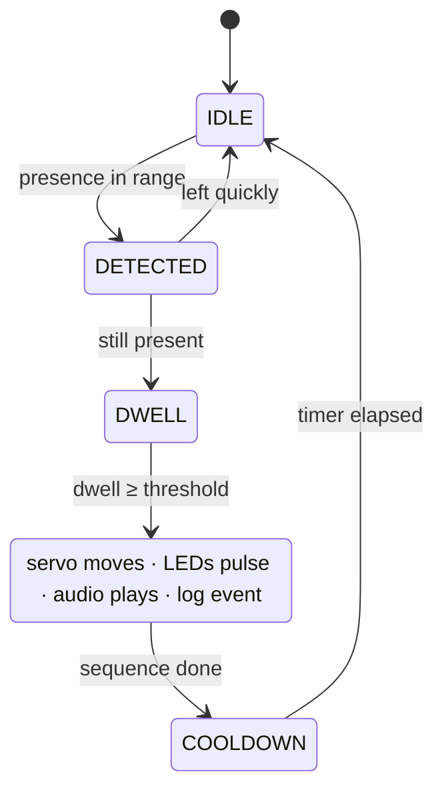

**v1 behaviour:** one audio line on trigger, then a **cooldown** before it can
fire again. Dwell time is still measured and logged for analytics, but it does
**not** branch behaviour yet — adaptive multi-line-on-dwell is a later firmware
revision (the state machine already leaves room for it).

### 8.2 Firmware structure (PlatformIO)

```
firmware/
├─ platformio.ini
├─ src/
│  ├─ main.cpp                # task setup, wiring
│  ├─ config.h                # pins, thresholds, topics
│  ├─ net/
│  │  ├─ wifi_provision.cpp   # SoftAP captive portal
│  │  ├─ mqtt_client.cpp      # connect, LWT, pub/sub
│  │  └─ ota.cpp              # esp_https_ota + audio download
│  ├─ sensors/
│  │  └─ ld2410.cpp           # mmWave parse, presence + dwell
│  ├─ actuators/
│  │  ├─ servo.cpp
│  │  └─ leds.cpp             # WS2812 (FastLED)
│  ├─ audio/
│  │  └─ player.cpp           # I²S → MAX98357A from LittleFS
│  ├─ logic/
│  │  └─ interaction.cpp      # state machine
│  └─ telemetry/
│     └─ reporter.cpp         # event batching + JSON
└─ data/                      # default audio for LittleFS image
```

### 8.3 State-machine core (representative)

```cpp
// logic/interaction.cpp  (runs in InteractionTask)
void interactionLoop() {
  switch (state) {
    case IDLE:
      if (presence.inRange()) { state = DETECTED; tEnter = millis(); }
      break;
    case DETECTED:
      if (!presence.inRange()) state = IDLE;
      else if (millis() - tEnter > DWELL_MS) state = PERFORM;
      break;
    case PERFORM:
      servo.playGesture();            // move the product
      leds.pulse(brandColor);         // WS2812 attention effect
      audio.play(activeClip);         // I²S clip from flash
      reporter.event("dwell", millis() - tEnter);
      reporter.event("play", audio.clipId());
      state = COOLDOWN; tEnter = millis();
      break;
    case COOLDOWN:
      if (millis() - tEnter > COOLDOWN_MS) state = IDLE;
      break;
  }
}
```

---

## 9. Frontend — multi-tenant dashboard

**Stack:** **Next.js (App Router) + TypeScript + Tailwind + shadcn/ui**,
**TanStack Query** for server state, **Socket.IO client** for live status,
**Recharts** for analytics.

### 9.1 Two surfaces, one app

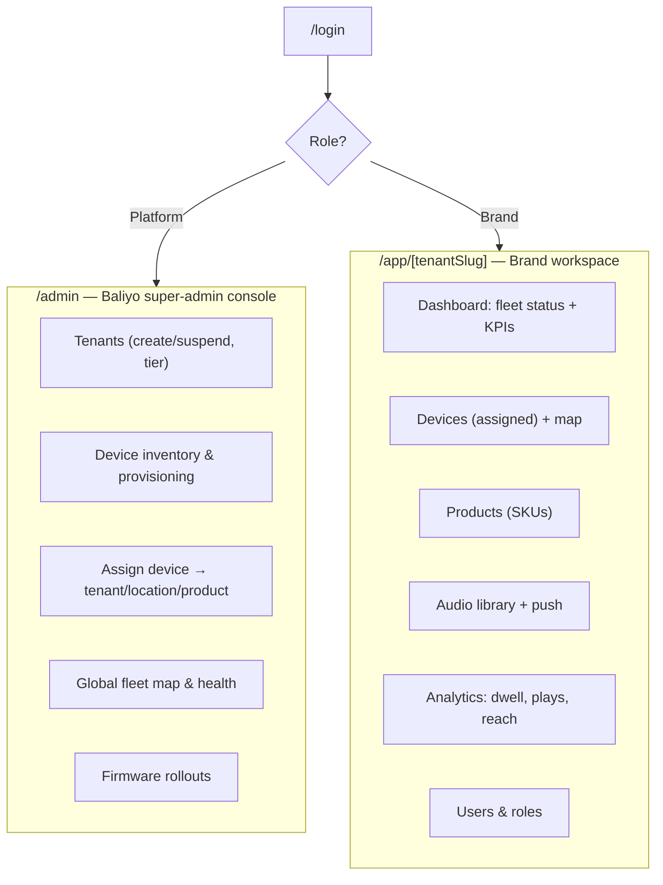

**Tenant resolution:** path-based `/app/[tenantSlug]/…` to start (simple, no DNS
work); subdomains (`xtreme.app.baliyo.io`) later. A platform admin can **switch
tenant / impersonate** to support onboarding (sends `x-tenant-id`, server checks
platform role).

### 9.2 Structure

```
frontend/
├─ app/
│  ├─ (auth)/login/
│  ├─ admin/                  # platform-only (guarded by role)
│  │  ├─ tenants/
│  │  ├─ devices/            # inventory + provisioning
│  │  └─ fleet/
│  ├─ app/[tenantSlug]/       # brand workspace
│  │  ├─ page.tsx            # overview KPIs
│  │  ├─ devices/
│  │  ├─ products/
│  │  ├─ audio/
│  │  ├─ analytics/
│  │  └─ users/
│  └─ layout.tsx
├─ components/                # ui/, charts/, device-status/
├─ lib/
│  ├─ api.ts                 # typed client
│  ├─ auth.ts                # session, role helpers
│  └─ realtime.ts            # socket subscription
└─ hooks/                     # useDevices, useAnalytics, useLiveStatus
```

### 9.3 Key screens
- **Super-admin fleet map** — every device across every tenant, colour-coded by status; filter by brand.
- **Provisioning** — register a serial, generate token, assign to a tenant/location/product.
- **Brand dashboard** — online/offline count, today's detections & plays, dwell distribution, per-store breakdown.
- **Audio library** — upload, preview, assign to devices, **Push** (with per-device ack state from the command channel).

---

## 10. Deployment — Coolify + Docker

Everything runs on **Coolify** (self-hosted PaaS) on a VPS. Coolify's built-in
Traefik handles TLS and routing; Postgres, Redis, and MinIO are one-click
resources; the API, workers, web app, and EMQX deploy as Docker services from
git. This keeps cost low and gives git-push deploys without managing k8s.

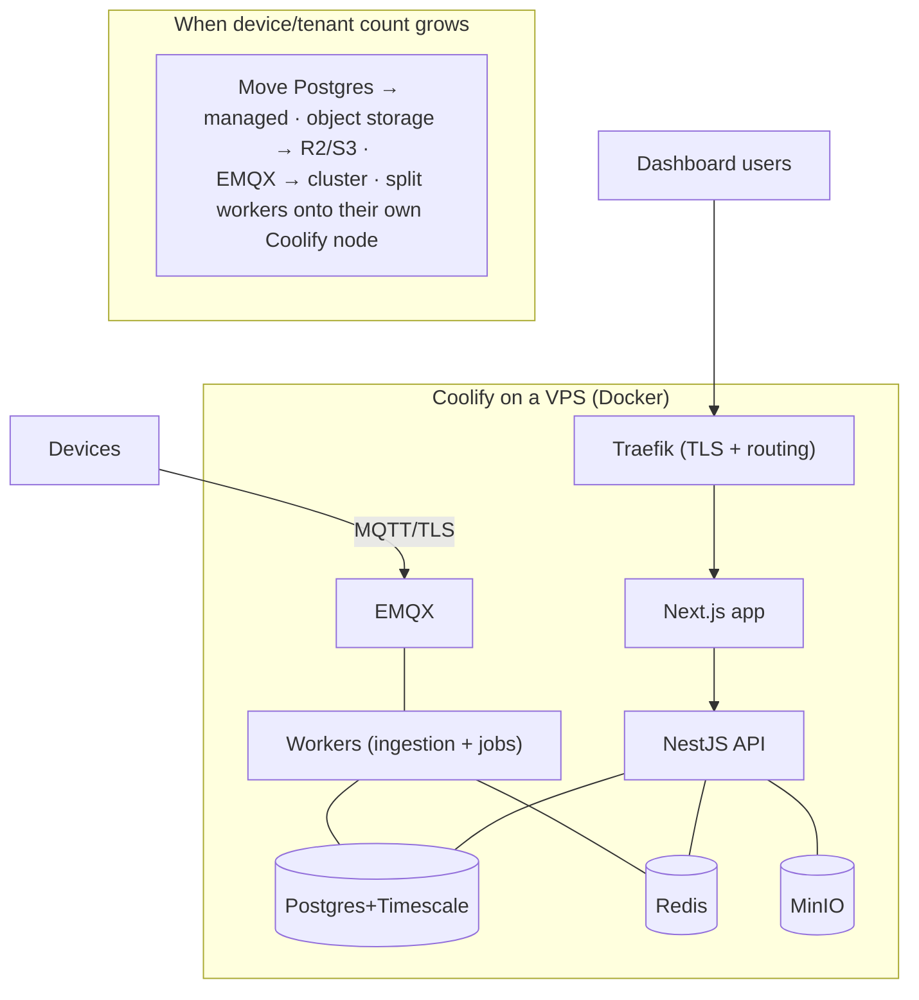

**Now:** one Coolify VPS runs the whole platform — enough for 100–500 devices at
very low cost. **Later:** move Postgres to managed, storage to R2/S3, and cluster
EMQX once device or tenant count justifies it — each is an isolated swap because
services are already containerised.

> **Coolify deploy notes:** one project, resources = `web` (Next.js), `api`
> (NestJS), `worker` (same image, worker entrypoint), `emqx`, `postgres`,
> `redis`, `minio`. Use a `docker-compose.yml` for the custom services and
> Coolify's managed databases for Postgres/Redis. Set secrets via Coolify env
> vars; point BetterAuth's base URL at the `api` domain.

---

## 11. Key architecture decisions (mini-ADRs)

| # | Decision | Chosen | Rejected | Rationale |
|---|---|---|---|---|
| 1 | App topology | Modular monolith | Microservices | Small team, one deployable; module boundaries keep future split cheap |
| 2 | Tenancy isolation | Shared schema + `tenant_id` + RLS | Schema/DB per tenant | Cheapest, safe via RLS, easy cross-tenant admin |
| 3 | Broker | EMQX | Mosquitto / cloud IoT | Per-device auth + ACL + scale without vendor lock-in |
| 4 | Telemetry store | Postgres + TimescaleDB | Separate TSDB | One engine to run; hypertables + continuous aggregates are enough |
| 5 | Big payloads | HTTPS from object storage | Over MQTT | MQTT stays light; audio/firmware via signed URLs + checksum |
| 6 | Firmware framework | Arduino-ESP32 (PlatformIO) | ESP-IDF now | Sprint speed; ESP-IDF is the later hardening path |
| 7 | Tenant routing | Path-based `/app/[slug]` | Subdomains now | No DNS/cert work to start; subdomains later |
| 8 | Auth & orgs | **BetterAuth** (organization plugin) | Custom JWT | Team already runs BetterAuth multi-tenant; orgs map cleanly to tenants |
| 9 | Hosting | **Coolify + Docker** | Raw Compose / k8s | Git deploys, auto-TLS, one-click DBs; Docker throughout, easy to scale out |
| 10 | v1 interaction | One line + cooldown | Adaptive-on-dwell now | Simplest reliable v1; dwell still logged, adaptive audio deferred |

---

## 12. Build order (maps to Sprint 01 + beyond)

> **MQTT is the one unfamiliar piece for the team** — budget a **1–2 day spike
> before wiring real ingestion:** run EMQX in Docker (Coolify), poke it with
> [MQTTX](https://mqttx.app) as a fake device, then wire a NestJS consumer
> (`@nestjs/microservices` MQTT transport, or `mqtt.js` in the ingestion worker).
> Everything else (NestJS, Next.js, Postgres, BetterAuth) is already in the
> team's wheelhouse.

1. **Contracts first** — lock the MQTT topics + JSON event/command schemas (§6). Firmware and backend build against these in parallel.
2. **Backend skeleton** — NestJS + Prisma schema + auth + tenants/devices modules + RLS migration.
3. **Ingestion path** — EMQX + ingestion worker writing `DEVICE_EVENT`; device shows online.
4. **Firmware loop** — state machine → servo/LED/audio → publish events (§8).
5. **Audio push** — upload → object storage → `audio_update` command → device ack.
6. **Dashboard** — brand workspace (device status + analytics) then super-admin console.
7. **Provisioning UX** — register/assign flow; Wi-Fi onboarding portal.

---

*Companion to [TOKINOMO_MASTER.md](TOKINOMO_MASTER.md) (product/business) and
[ELECTRONICS_BOM.md](ELECTRONICS_BOM.md) (hardware). This file is the technical
architecture of record.*
