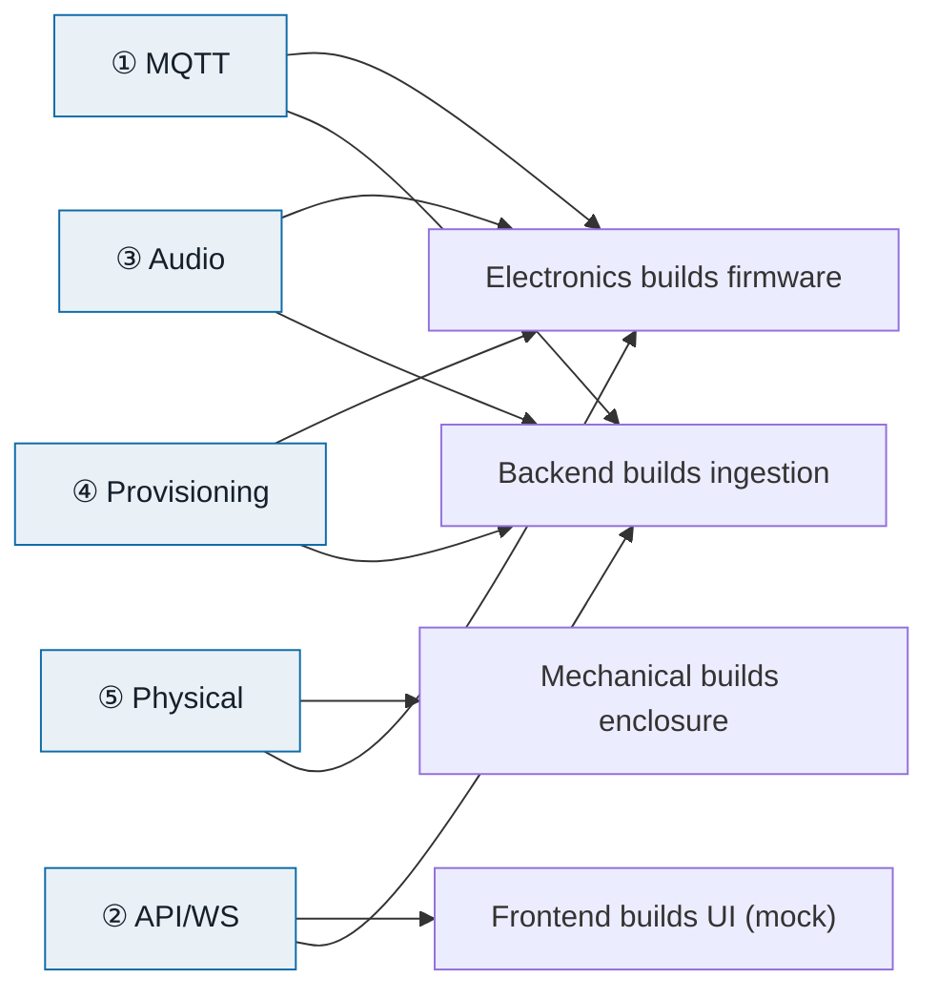

# Tokinomo — Interface Contracts

**The single file every team builds against.** Companion to
[ARCHITECTURE.md](ARCHITECTURE.md) and the three team files
([Electronics](ELECTRONICS_ARCHITECTURE.md) · [Backend](BACKEND_ARCHITECTURE.md) ·
[Frontend](FRONTEND_ARCHITECTURE.md)).

> **Why a contracts file at all?** Four teams can only build in parallel if the
> *seams* between them are frozen and written down. A contract lets Frontend mock
> what Backend hasn't built, lets Electronics publish events before the dashboard
> exists, and lets Mechanical cut an enclosure before the board is final. Change a
> contract and you change other people's work — so contracts have **owners** and a
> **change process**, below.

---

## The five contracts at a glance

| # | Contract | Between | 🔵 Owner (Accountable) | 🟢 Drafts (Responsible) | 🟡 Consulted |
|---|---|---|---|---|---|
| ① | MQTT topics + messages | Electronics ↔ Backend | Lead | Backend | Electronics |
| ② | REST + WebSocket API | Backend ↔ Frontend | Lead | Backend | Frontend |
| ③ | Audio file spec | Electronics ↔ Backend ↔ Brand | Lead | Electronics | Backend, Brand |
| ④ | Provisioning record | Electronics ↔ Backend | Lead | Backend | Electronics |
| ⑤ | Physical interface | Mechanical ↔ Electronics | Lead | Mechanical | Electronics |

*(🔵 owns the final call · 🟢 writes the spec · 🟡 must sign off before it's frozen. Same legend as [Team Playbooks §7](TEAM_PLAYBOOKS.md).)*

---

## Governance — how contracts change

- **One home:** this file is the canonical copy. The OpenAPI spec (②) also lives in the backend repo, generated; this file links to it.
- **Versioned:** each contract has a version. Message/API schemas carry a `v` field or a `/v1` path so old firmware/clients don't break.
- **Change process:** propose a change as a PR to this file → the **Drafts** team writes it, the **Consulted** team(s) sign off, the **Owner** approves. No silent edits — a contract change is a cross-team event.
- **Additive-first:** prefer adding optional fields over changing/removing existing ones. Breaking changes bump the version and need a migration note.

---

## ① MQTT topics + message schemas  (Electronics ↔ Backend)

**What it defines:** how a device and the cloud talk — topic names, message JSON, QoS, presence.

### Why MQTT (and why not the alternatives)

| Option | Verdict |
|---|---|
| **MQTT (EMQX)** ✅ | Built for exactly this: tiny devices, unreliable networks, push both ways. Gives **pub/sub topics, QoS, retained messages, and Last-Will (LWT)** out of the box — presence detection is essentially free. |
| HTTP polling | ❌ Devices sit behind shop NAT/Wi-Fi; the cloud can't reach *in* to push a command. Polling wastes bandwidth/battery and adds latency. |
| Raw WebSocket | ❌ No topics, no QoS, no retained/LWT — you'd reinvent half of MQTT by hand, per device. |
| CoAP | ❌ UDP-based, thinner tooling, no broker ecosystem or dashboard. |
| Cloud IoT (AWS IoT Core, etc.) | ❌ Per-message/per-device pricing and vendor lock-in. Self-hosting **EMQX on Coolify** is cheaper and portable. |

**Why EMQX over Mosquitto:** per-device **auth + topic ACL hooks**, a management
dashboard, and clustering for scale. Mosquitto is fine for a hobby broker but
weak on multi-tenant auth — which is the whole point here.

**Why JSON payloads (for now):** human-readable, trivially debuggable with MQTTX,
and the team already lives in JSON. Event volume is low (a few small messages per
interaction), so bytes aren't the bottleneck. *Why not protobuf/CBOR yet:* they
save bandwidth but cost debuggability and add a schema-compile step — revisit only
if message volume or cell data ever enters the picture.

### Topic tree
`t/{tenantId}/d/{deviceId}/{channel}` — **namespaced by tenant + device** so an
EMQX ACL can lock each device to *only its own* subtree. *Why not a flat topic
like `events`?* Because then any device could subscribe to everyone's traffic —
the namespacing **is** the tenant isolation at the transport layer.

| Channel | Dir | QoS | Retained | Purpose |
|---|---|---|---|---|
| `status` | D→C | 1 | ✅ (LWT) | `online`/`offline` presence |
| `telemetry` | D→C | 1 | — | heartbeat, RSSI, uptime, fw |
| `event` | D→C | 1 | — | detection / dwell / play |
| `cmd` | C→D | 1 | — | play, config, audio_update, reboot |
| `ack` | D→C | 1 | — | command results |

*Why QoS 1:* "at least once" — we can't lose an event or a command, and duplicates
are cheap to de-dupe by `id`/`ts`. *Why not QoS 2:* the extra handshake isn't worth
it for idempotent, timestamped messages. *Why retained status:* a dashboard opening
mid-session immediately learns each device's last known state.

### Canonical messages  (`v` = schema version)
```jsonc
// status   (retained; LWT sets offline)        D→C
{ "v":1, "status":"online", "fw":"1.0.3", "ts":1690000000 }

// telemetry  (~every 30 s)                      D→C
{ "v":1, "ts":1690000030, "rssi":-58, "uptime_s":12345, "free_heap":123456, "fw":"1.0.3" }

// event                                          D→C
{ "v":1, "ts":1690000045, "type":"dwell", "dwell_ms":8200 }
{ "v":1, "ts":1690000046, "type":"play",  "clipId":"clip_abc", "version":3 }

// cmd                                            C→D
{ "id":"cmd_123","type":"audio_update","url":"https://…/clip.wav","checksum":"sha256:…","version":3,"clipId":"clip_abc" }
{ "id":"cmd_125","type":"config","dwellMs":6000,"cooldownMs":15000,"volume":80,"ledColor":"#00A0E0" }

// ack                                            D→C
{ "id":"cmd_123","ok":true,"type":"audio_update","version":3,"ts":1690000060 }
{ "id":"cmd_123","ok":false,"error":"checksum_mismatch" }
```

**Rules:** large payloads (audio/firmware) **never** travel over MQTT — commands
carry an HTTPS URL + checksum instead. Devices **buffer events locally** and flush
on reconnect (shop Wi-Fi drops).

### Roles
- **Backend** drafts the schema + runs the broker/ACL. **Electronics** implements it and must sign off that it's flashable/parseable on-device. **Lead** owns the final call. **Frontend** is informed (events surface in their dashboards).

---

## ② REST + WebSocket API  (Backend ↔ Frontend)

**What it defines:** every endpoint the dashboard calls, request/response types,
auth, and the realtime event stream — published as an **OpenAPI spec**.

### Why REST + OpenAPI (and why not the alternatives)

| Option | Verdict |
|---|---|
| **REST + OpenAPI** ✅ | Language-agnostic, generates **typed clients + mocks** (Frontend builds before Backend is done), and doubles as the **public API** the Brand/Enterprise tier sells. Dashboards have well-defined queries — REST fits. |
| GraphQL | ❌ Flexible querying we don't need here; adds caching/complexity and a schema server for a fixed set of screens. |
| tRPC | ⚠️ Great DX *if* FE+BE share one TS monorepo — but it couples them and isn't language-neutral. We want a decoupled, documented API (also exposed to Brand-tier customers), so OpenAPI wins. |
| gRPC (browser) | ❌ Needs a grpc-web proxy; friction for a web dashboard. |

**Why WebSocket (Socket.IO) for realtime:** device status must update *live*
without refresh. *Why not SSE:* one-way only and clunkier to reconnect; Socket.IO
gives rooms (scope events per tenant) and auto-reconnect. *Why not polling:* wasteful
and laggy for a fleet view — acceptable only as a fallback.

### Conventions
- **Auth:** BetterAuth session cookie; every request resolves a tenant from the session (or `x-tenant-id` for platform impersonation). **Tenant scoping is server-side**, never trusted from the client.
- **Versioned** under `/v1`; **paginated** list endpoints; a single **error shape** `{ error: { code, message } }`.
- **Contract published early:** Backend ships the OpenAPI + **seed data** on day 2–3 so Frontend mocks with MSW and is never blocked.

Representative surface (full list in [Backend §8](BACKEND_ARCHITECTURE.md)):
`/auth/*` · `/tenants` (platform) · `/devices` · `/devices/provision` · `/devices/:id/assign` · `/products` · `/locations` · `/audio` · `/audio/:id/push` · `/analytics/*` · `WS /realtime`.

### Roles
- **Backend** owns and generates the OpenAPI spec. **Frontend** is consulted — they tell Backend the exact data each screen needs so endpoints match the UI. **Lead** approves. Electronics/Mechanical informed only.

---

## ③ Audio file spec  (Electronics ↔ Backend ↔ Brand)

**What it defines:** the format and limits of a playable clip, so what a brand
uploads is guaranteed to play on-device.

### Why WAV (PCM) first (and why not the others)

| Option | Verdict |
|---|---|
| **WAV, PCM, mono, 16 kHz, 16-bit** ✅ | **Zero decode cost** on the ESP32 — stream straight to I²S. Deterministic, no codec/licensing surprises. Perfect for short shelf lines. |
| MP3 | ⚠️ ~10× smaller, but needs a decoder library + CPU headroom. Move here **only** if flash space or download size becomes the constraint. |
| OGG/Opus | ⚠️ Best compression, but heavier decode on an MCU already juggling Wi-Fi + servo. Not worth it for a few-second clip. |

**Trade-off, stated:** we optimise for **reliable playback on a busy MCU** over
file size, because clips are short and stored locally. Flash is 16 MB — plenty for
WAV clips. Reassess format if the clip library grows.

### Spec (v1)
| Field | Value |
|---|---|
| Container / codec | WAV / PCM |
| Channels | Mono |
| Sample rate | 16 kHz |
| Bit depth | 16-bit |
| Max length | ~10 s *(confirm)* |
| Max file size | ~512 KB *(confirm)* |
| Loudness | Normalised to a target level so all clips play at even volume |
| Integrity | **SHA-256** checksum, verified on-device after download |
| Delivery | HTTPS **signed URL** (time-limited), pushed via `cmd audio_update` — **not** over MQTT |

### Roles
- **Electronics** owns the limits (they know the decode/flash constraints). **Backend** enforces them on upload (transcode/validate) and generates signed URLs + checksums. **Brand** supplies the content within spec. **Lead** approves.

---

## ④ Provisioning record  (Electronics ↔ Backend)

**What it defines:** how a physical device becomes a known, authenticated,
assignable unit in the platform.

### Why per-device tokens first (and why not certs yet)

| Option | Verdict |
|---|---|
| **Per-device token** (serial + secret) ✅ | Simple to flash and to verify via an EMQX auth hook. Good enough to isolate devices for launch. |
| mTLS client certificates | ⚠️ Stronger (no shared-secret risk), but adds a cert-provisioning + rotation pipeline. Planned hardening, not launch. |
| Shared/global key | ❌ One leak compromises the whole fleet. Never. |

### The record
| Field | Set by | Notes |
|---|---|---|
| `serial` | Electronics (at flash) | Unique, printed/QR on the unit |
| `token` | Backend (issued) | Device's MQTT password; per-device |
| `fwVersion` | Device (reports) | In `status`/`telemetry` |
| `status` | Backend | `unassigned → provisioning → online/offline` |
| `tenantId / locationId / productId` | Backend (on assign) | Null until a platform admin assigns it |

**Lifecycle:** flash (serial+token) → register (`unassigned`) → Wi-Fi onboard →
authenticate → **platform admin assigns to tenant/location/product** → appears in
the brand workspace.

### Roles
- **Backend** owns the registry, issues tokens, and runs assignment. **Electronics** provides the serial + burns credentials at flash time and reports firmware version. **Lead** approves the scheme.

---

## ⑤ Physical interface  (Mechanical ↔ Electronics)

**What it defines:** the mechanical envelope so the enclosure and the board fit,
the sensor aims correctly, and the servo can actually move the product.

**Why Mechanical owns this doc (not Electronics):** the enclosure is the harder
thing to change late — a PCB respin is a week, a re-tooled/re-printed body plus
re-fitting is worse. So Mechanical holds the master dimensions and Electronics
designs the board **to fit it**, co-signing the constraints.

### What it captures
| Item | Why it matters |
|---|---|
| Board outline + mount-hole positions | Board must seat in the body |
| Connector & port positions (USB, power, speaker, servo leads) | Access + cable routing |
| **mmWave aiming window** | Radar must see the aisle — no metal/obstruction in front |
| Servo location + **throw envelope** | The arm must reach and move the product without fouling the case |
| Speaker grille + LED light-pipe/window | Sound out, light visible |
| Battery compartment + access | Swap/charge without a full teardown |
| Heat sources + ventilation | ESP32 + amp + buck shouldn't cook the pack |

### Roles
- **Mechanical** owns and maintains the interface doc + CAD. **Electronics** is consulted (supplies board size, component heights, servo throw, sensor facing) and co-signs. **Lead** approves the go-to-print geometry.

---

## Dependency map — who's blocked until a contract is frozen



**Week-1 goal:** freeze ①–⑤ here. After that, Electronics, Backend, Frontend, and
Mechanical each build against a stable contract — and integration becomes swapping
mocks for the real thing, not renegotiating interfaces.
