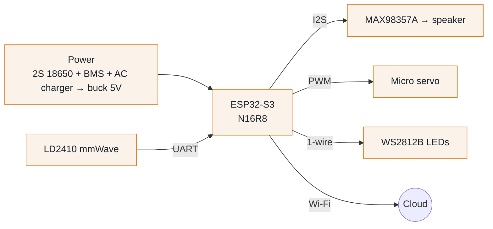
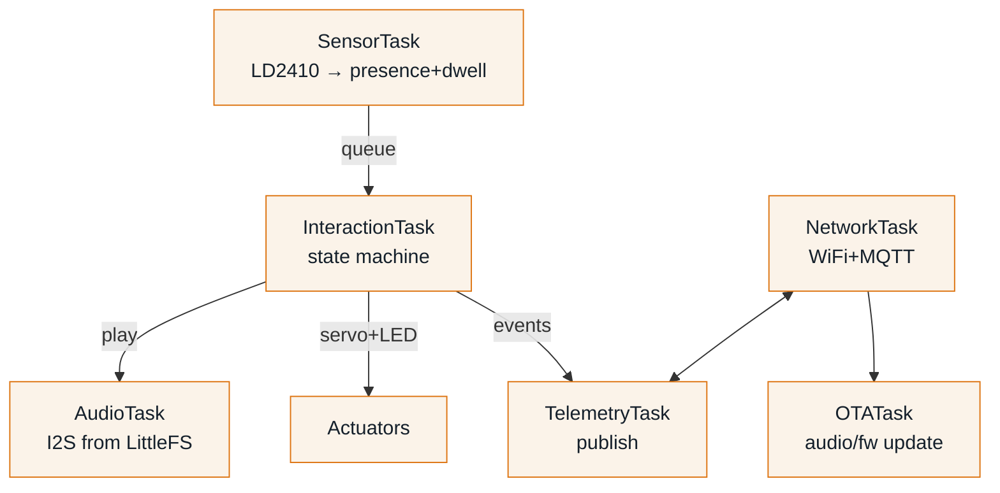

# Electronics & Firmware — Architecture & Work Plan

**Team:** Electronics / Firmware · **Owner:** (electronics lead)
**Companion to** [ARCHITECTURE.md](ARCHITECTURE.md) · [TEAM_PLAYBOOKS.md](TEAM_PLAYBOOKS.md) · [ELECTRONICS_BOM.md](ELECTRONICS_BOM.md)

> **Your mission:** make **one** device reliably sense a shopper, perform
> (move + light + speak), and report to the cloud — then reproduce it across
> 4–5 matrix-board units, and only then commit to a PCB. You own two worlds:
> the **circuit/hardware** and the **firmware** that runs on it.

---

## 1. What you must achieve

| # | Outcome | Proof it's done |
|---|---|---|
| 1 | One device runs the full loop: detect → (dwell logged) → perform → cooldown → report | Live demo on the bench |
| 2 | Events land on the MQTT broker in the **agreed schema** | Backend sees them in the DB |
| 3 | Audio can be replaced over the air | `audio_update` command swaps the clip + acks |
| 4 | 4–5 units built on matrix board and stress-tested | Survives Wi-Fi drop/reconnect, power cycles |
| 5 | Per-unit cost + reliability documented for go/no-go | Written notes at Fri review |

**v1 behaviour (locked):** one audio line on trigger, then a **cooldown**. Dwell
time is measured and logged for analytics but does **not** branch behaviour yet.

---

## 2. Hardware architecture



### 2.1 Pin map (illustrative — finalise with the schematic)

| Function | Signal | GPIO (TBD) | Notes |
|---|---|---|---|
| LD2410 mmWave | UART RX ← sensor TX | GPIO18 | 256000 baud default |
| LD2410 mmWave | UART TX → sensor RX | GPIO17 | |
| MAX98357A | I²S BCLK | GPIO15 | |
| MAX98357A | I²S LRCLK (WS) | GPIO16 | |
| MAX98357A | I²S DIN | GPIO7 | |
| Servo | PWM | GPIO4 | 50 Hz; power from 5V rail, **not** 3V3 |
| WS2812B | Data | GPIO5 | level-shift to 5V if needed |
| Provision button | Input (pull-up) | GPIO0 | hold = enter Wi-Fi setup |
| Status LED | Output | GPIO2 | onboard/aux |
| Battery sense (opt.) | ADC | GPIO1 | divider from pack |

### 2.2 Power subsystem (from ARCHITECTURE §5)
`AC adapter → CC/CV 2S charger → BMS → 2S 18650 pack → buck → 5V` (ESP board LDO → 3.3V).
- **Bulk cap ≈1000 µF** on the 5V rail to absorb servo current spikes.
- Size the pack against measured draw once the loop runs.
- BMS: over-charge / over-discharge / short / balance — non-negotiable for a device left unattended.

### 2.3 Matrix board → PCB
1. Breadboard bring-up of each subsystem alone.
2. Integrate all subsystems on **matrix board** (4–5 units).
3. Stress + soak test. Document failures.
4. **Only after validation:** lay out the PCB → first 5 local → 95 later.

---

## 3. Firmware architecture

**Framework:** **PlatformIO + Arduino-ESP32** (sprint speed; ESP-IDF is the later
hardening path). **FreeRTOS tasks** keep sensing, networking, and performance
independent so a Wi-Fi stall never freezes the interaction.



### 3.1 Interaction state machine (v1)
`IDLE → DETECTED → (dwell measured) → PERFORM → COOLDOWN → IDLE`
- **PERFORM:** servo gesture + LED pulse + play the one active clip; log `dwell` and `play` events.
- **COOLDOWN:** ignore triggers for `cooldownMs` so it doesn't spam.

### 3.2 Project structure (PlatformIO)
```
firmware/
├─ platformio.ini
├─ src/
│  ├─ main.cpp            # task setup + wiring
│  ├─ config.h            # pins, thresholds, topic templates
│  ├─ net/  wifi_provision.cpp · mqtt_client.cpp · ota.cpp
│  ├─ sensors/  ld2410.cpp
│  ├─ actuators/  servo.cpp · leds.cpp
│  ├─ audio/  player.cpp
│  ├─ logic/  interaction.cpp
│  └─ telemetry/  reporter.cpp
└─ data/                  # default clip for the LittleFS image
```

### 3.3 Packages / libraries (`platformio.ini → lib_deps`)

| Purpose | Library |
|---|---|
| MQTT client | `knolleary/PubSubClient` (or `256dpi/arduino-mqtt` for larger buffers) over `WiFiClientSecure` |
| JSON | `bblanchon/ArduinoJson` |
| mmWave | `ncmreynolds/ld2410` |
| Servo | `madhephaestus/ESP32Servo` |
| LEDs | `fastled/FastLED` (or `adafruit/Adafruit NeoPixel`) |
| Audio (I²S WAV/MP3) | `earlephilhower/ESP8266Audio` (AudioOutputI2S + AudioGeneratorWAV) or `pschatzmann/arduino-audio-tools` |
| Wi-Fi provisioning | `tzapu/WiFiManager` (captive portal) |
| Config store | `Preferences` (NVS, built-in) |
| Filesystem | `LittleFS` (built-in) |
| OTA (firmware) | `Update` / `HTTPUpdate` (`esp_https_ota`, A/B partitions) |
| OTA (audio) | `HTTPClient` (download to LittleFS) |

> **Audio format** is a shared contract (③). Start with **WAV (PCM, mono, 16 kHz)**
> for simplicity/CPU; move to MP3 if flash space matters. Agree the final format,
> sample rate, and max size with Backend before recording.

---

## 4. The MQTT contract (you ↔ Backend) — contract ①

Topics are namespaced `t/{tenantId}/d/{deviceId}/...`. Device authenticates to
EMQX with its **serial + provisioning token**; ACL restricts it to its own
subtree.

```jsonc
// status  (retained; LWT publishes offline)   D→C
{ "status": "online", "fw": "1.0.3", "ts": 1690000000 }

// telemetry  (every ~30 s)                     D→C
{ "ts": 1690000030, "rssi": -58, "uptime_s": 12345, "free_heap": 123456, "fw": "1.0.3" }

// event                                         D→C
{ "ts": 1690000045, "type": "dwell", "dwell_ms": 8200 }
{ "ts": 1690000046, "type": "play",  "clipId": "clip_abc", "version": 3 }

// cmd                                           C→D
{ "id":"cmd_123","type":"audio_update","url":"https://…/clip.wav","checksum":"sha256:…","version":3,"clipId":"clip_abc" }
{ "id":"cmd_124","type":"play","clipId":"clip_abc" }
{ "id":"cmd_125","type":"config","dwellMs":6000,"cooldownMs":15000,"volume":80,"ledColor":"#00A0E0" }
{ "id":"cmd_126","type":"reboot" }

// ack                                           D→C
{ "id":"cmd_123","ok":true,"type":"audio_update","version":3,"ts":1690000060 }
{ "id":"cmd_123","ok":false,"error":"checksum_mismatch" }
```

- **QoS 1** for events/commands; **status retained** so the broker always knows presence.
- **Offline tolerance:** if Wi-Fi/MQTT drops, buffer events locally (ring buffer in RAM/NVS) and flush on reconnect — shop Wi-Fi *will* be flaky.
- **Large payloads never go over MQTT** — `audio_update` carries an HTTPS URL + checksum; you download over `HTTPClient`, verify, then swap.

---

## 5. Provisioning & OTA (your side)
- **Wi-Fi onboarding:** hold the provision button → `WiFiManager` captive portal → installer selects shop SSID + password → saved to NVS.
- **Identity:** each unit flashed with a unique **serial + token**; report `fw` version in `status`/`telemetry`.
- **Audio OTA:** download to LittleFS → verify checksum → atomically switch active clip → `ack`.
- **Firmware OTA:** `esp_https_ota` with **A/B partitions** + rollback on bad boot.

---

## 6. Tasks

### Sprint-01 (Sun 26 → Fri 31)
- **Day 1: gather ALL components** (import-first: ESP32-S3, LD2410, MAX98357A). *This unblocks the whole company.*
- ESP32-S3 on Wi-Fi; read LD2410 presence/distance.
- Audio playback from LittleFS; tune dwell threshold + cooldown.
- Wire servo + WS2812; run the full state machine on one unit.
- Publish events to the broker in the agreed schema (pair with Backend).
- Replicate across 4–5 units; stress-test Wi-Fi drop/reconnect + power cycle.
- Document per-unit cost + reliability for go/no-go.

### Backlog (post-sprint)
- PCB layout + DFM; first 5 local boards.
- Firmware OTA (A/B) hardening; secure MQTT (TLS/certs).
- Adaptive-on-dwell behaviour (v2); battery telemetry; power optimisation.
- Consider migrating core to ESP-IDF for production.

---

## 7. How you coordinate with other teams

| With | On | You give | You need |
|---|---|---|---|
| **Backend** | Contract ① MQTT, ③ audio, ④ provisioning | Real device events in-schema; fw version; ack behaviour | Broker URL + device credentials/ACL; command payloads; signed audio URLs; final audio format |
| **Mechanical** | Contract ⑤ physical interface | Board dimensions, connector positions, servo throw, **where the mmWave must face**, speaker + LED cutouts, heat sources | Enclosure that holds the board, aims the sensor, mounts the servo to the product |
| **Frontend** | Indirect | The events that populate their dashboards | (nothing direct — via Backend) |
| **Lead (Manav)** | Go/no-go | Cost + reliability data | Decision to order PCBs |

**Working rhythm:** lock contracts ①/③/⑤ in week 1 (a short `CONTRACTS.md`), then
build against them. Pair with Backend on the very first end-to-end event so the
schema is real, not assumed.

---

## 8. Testing & validation
- **Unit bench tests:** each subsystem alone (sensor read, audio play, servo sweep, LED).
- **Integration:** full loop timing; ensure audio/Wi-Fi don't brown out on servo move (verify the bulk cap).
- **Resilience:** kill Wi-Fi mid-operation; power-cycle; confirm buffered events flush and device re-registers `online`.
- **Soak:** run for hours; watch heap for leaks, check thermals.
- **Field:** one unit in a real shelf/Wi-Fi environment before the 100 order.

---

## 9. Definition of done
One unit runs detect→perform→cooldown→report reliably; 4–5 units built and
stress-tested; events land on the broker in the agreed schema; audio swaps via
`audio_update` with ack; cost + reliability documented; go/no-go recorded.

## 10. Risks
- **Concurrency** (audio + Wi-Fi + servo) → FreeRTOS task isolation + bulk cap.
- **Flaky shop Wi-Fi** → local buffering + robust reconnect + LWT.
- **mmWave false triggers** → tune gate/dwell thresholds; validate in a real aisle.
- **Flash space for audio** → onboard 16 MB likely enough; external SPI flash only if needed.
