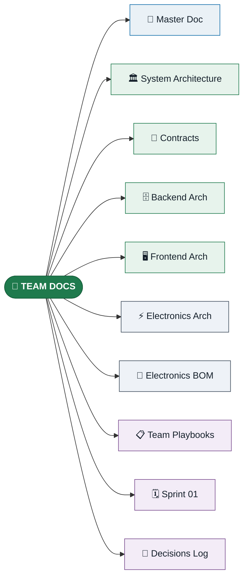

# Tokinomo — Team Handbook

**For the build teams: Electronics · Backend · Frontend · Mechanical.**
Everything you need to build the product lives here. (Business & pricing docs are
kept separately by the founders.)

> **Tip:** click any box to open that document. All links are also in the table below.

---

## All team documents

| Document | What it covers | For whom |
|---|---|---|
| [Master Doc](https://claude.ai/code/artifact/b2723f34-f664-4f63-bac4-1b6c7289fb18) | The complete product reference — vision, all hardware decisions, power, enclosure, software/SaaS, BOM summary, plan | Everyone |
| [System Architecture](https://claude.ai/code/artifact/0e63bf97-b09b-4330-be74-6035baecb407) | The architecture of record — multi-tenancy + RLS, data model, stack, MQTT, provisioning/OTA, deploy, ADRs | All software + leads |
| [Contracts](https://claude.ai/code/artifact/5c4b76c2-d287-4c1b-90b8-770283c28334) | The five shared interfaces (MQTT, REST/WS API, audio, provisioning, physical) — the seams all teams build against | All teams |
| [Backend Architecture](https://claude.ai/code/artifact/9875365e-f07d-4d59-aaea-cc11d0d6437b) | Stack + packages, modules, Prisma/RLS, BetterAuth, MQTT ingestion, audio push, API, deploy, tasks | Backend |
| [Frontend Architecture](https://claude.ai/code/artifact/c9329d9a-6e3f-4399-bf08-538c961dbdb0) | Stack + packages, app structure, auth/tenancy, both surfaces, mock-first, flows, tasks | Frontend |
| [Electronics Architecture](https://claude.ai/code/artifact/2347522f-8376-4245-83c3-019f1d8121de) | Hardware + firmware: block diagram, pin map, power, FreeRTOS tasks, state machine, libraries, MQTT contract, OTA | Electronics |
| [Electronics BOM](https://claude.ai/code/artifact/089a9128-a6f4-400c-b18a-fe5eb09b801e) | Per-unit parts list with Nepal sourcing (local vs import), optional vs non-optional | Electronics / procurement |
| [Team Playbooks](https://claude.ai/code/artifact/faaaada7-1b93-44f3-8dac-4beb21713f88) | The role split, shared seams, integration timeline, RACI matrix | All teams / leads |
| [Sprint 01](https://claude.ai/code/artifact/c8a3365d-2e4f-4f41-97e8-e986ac03e76b) | The first sprint, day-by-day per team (Sun 26 → Fri 31 Jul) with definition of done | All teams |
| [Decisions & Components Log](https://claude.ai/code/artifact/29cba96c-dc57-4a30-84b4-455235dee990) 🖨️ | Every parts/component & technical decision — options, rationale, owner, status (locked / under review / open). Printable. | All teams |

---

## Reading paths

**🆕 New team member:**
[Master Doc](https://claude.ai/code/artifact/b2723f34-f664-4f63-bac4-1b6c7289fb18) → [System Architecture](https://claude.ai/code/artifact/0e63bf97-b09b-4330-be74-6035baecb407) → your team's deep-dive → [Contracts](https://claude.ai/code/artifact/5c4b76c2-d287-4c1b-90b8-770283c28334) → [Sprint 01](https://claude.ai/code/artifact/c8a3365d-2e4f-4f41-97e8-e986ac03e76b)

**⚡ Electronics / firmware:**
[Electronics Architecture](https://claude.ai/code/artifact/2347522f-8376-4245-83c3-019f1d8121de) + [Electronics BOM](https://claude.ai/code/artifact/089a9128-a6f4-400c-b18a-fe5eb09b801e) + [Contracts](https://claude.ai/code/artifact/5c4b76c2-d287-4c1b-90b8-770283c28334) (① ③ ④ ⑤)

**🗄️ Backend:**
[Backend Architecture](https://claude.ai/code/artifact/9875365e-f07d-4d59-aaea-cc11d0d6437b) + [Contracts](https://claude.ai/code/artifact/5c4b76c2-d287-4c1b-90b8-770283c28334) (① ② ④) + [System Architecture](https://claude.ai/code/artifact/0e63bf97-b09b-4330-be74-6035baecb407)

**🖥️ Frontend:**
[Frontend Architecture](https://claude.ai/code/artifact/c9329d9a-6e3f-4399-bf08-538c961dbdb0) + [Contracts](https://claude.ai/code/artifact/5c4b76c2-d287-4c1b-90b8-770283c28334) (②) + [System Architecture](https://claude.ai/code/artifact/0e63bf97-b09b-4330-be74-6035baecb407)

**🔧 Mechanical:**
[Team Playbooks](https://claude.ai/code/artifact/faaaada7-1b93-44f3-8dac-4beb21713f88) (§5) + [Contracts](https://claude.ai/code/artifact/5c4b76c2-d287-4c1b-90b8-770283c28334) (⑤) + [Master Doc](https://claude.ai/code/artifact/b2723f34-f664-4f63-bac4-1b6c7289fb18) (enclosure)

---

## Locked decisions (quick reference)

- **Processor:** ESP32-S3 N16R8 · **Sensor:** mmWave (LD2410) · **Audio:** MAX98357A, uploaded WAV clips · **Motion:** metal-gear micro servo · **Light:** WS2812B
- **Power:** 2S 18650 + BMS + AC charging · **Connectivity:** Wi-Fi only (no SIM)
- **Auth/tenancy:** BetterAuth organizations + Postgres RLS · **Hosting:** Coolify + Docker
- **v1 interaction:** one audio line + cooldown (dwell logged) · **Prototype:** 4–5 on matrix board → PCB
- **First Xtreme demo scope:** working device + basic fleet/status view; full dashboard follows
- **Motion type:** open — Mechanical to prototype and decide (rock / lift / push)

---

## Contract-first working rule

Freeze the five contracts ([Contracts](https://claude.ai/code/artifact/5c4b76c2-d287-4c1b-90b8-770283c28334)) in week 1, then each team builds against a stable interface:
Backend publishes the OpenAPI + seed data early so Frontend isn't blocked; Electronics and Backend agree the MQTT schema so events are real, not assumed; Mechanical builds the enclosure from the board's physical spec. Integration becomes swapping mocks for the real thing — not renegotiating interfaces.

*The founders keep the business model, pricing, and proposal separately — ask a founder if you need commercial context.*
