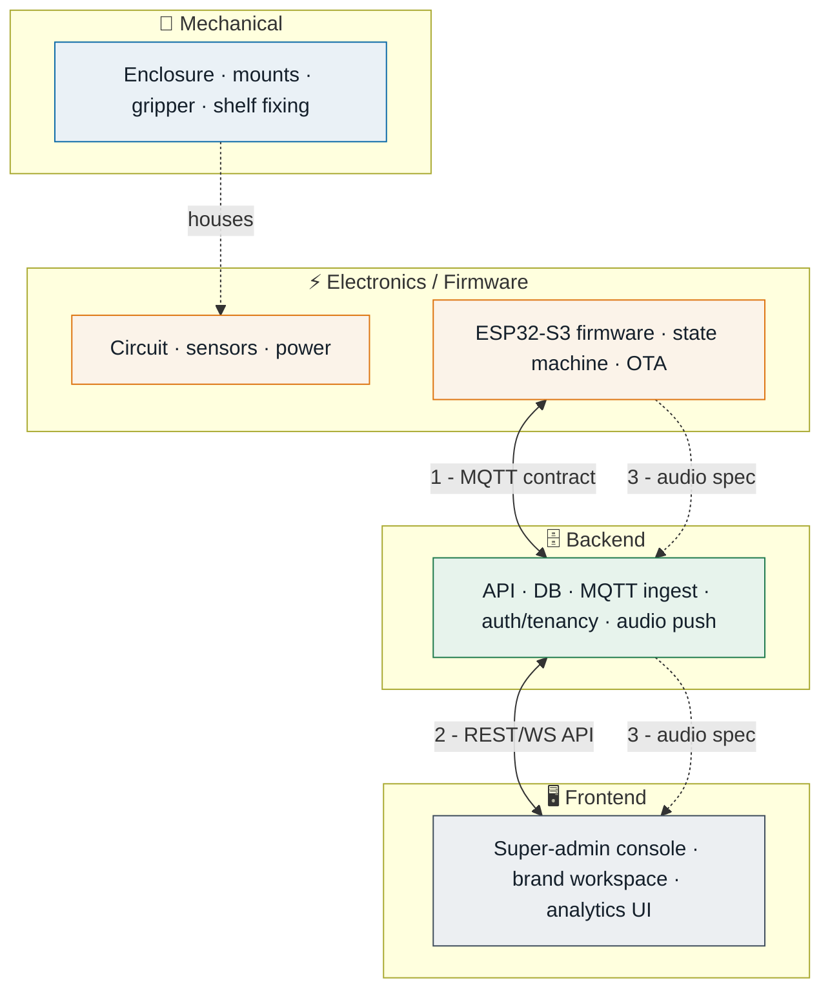
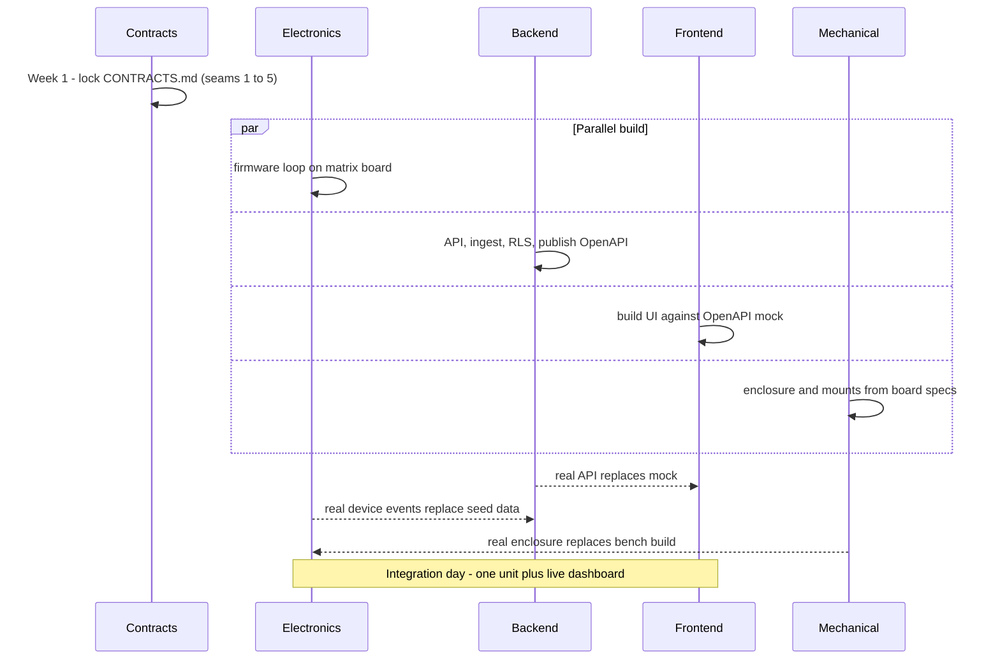

# Tokinomo — Team Playbooks

**Companion to [ARCHITECTURE.md](ARCHITECTURE.md).** This splits the one system
into four faculties so each team owns a clear slice and can work in parallel.

> **The golden rule of parallel work:** teams don't integrate by reading each
> other's code — they integrate through **contracts** (the seams in §1). Lock the
> contracts first; then Electronics, Backend, Frontend, and Mechanical can each
> move at their own pace.

---

## Ownership map



---

## 1. The seams — shared contracts (lock these first)

These are **jointly owned**; changing one needs sign-off from both sides. They
are the entire reason the teams can build independently.

| # | Contract | Between | Owner of the doc | Contains |
|---|---|---|---|---|
| ① | **MQTT topics + message schemas** | Electronics ↔ Backend | Backend drafts, Electronics reviews | Topic names, JSON for `event`/`telemetry`/`cmd`/`ack`, QoS, LWT |
| ② | **REST + WebSocket API** | Backend ↔ Frontend | Backend (OpenAPI spec) | Endpoints, request/response types, auth, WS events |
| ③ | **Audio file spec** | Electronics ↔ Backend ↔ Brand | Electronics sets limits | Format (e.g. WAV/MP3), sample rate, max size/length, checksum |
| ④ | **Device provisioning record** | Electronics ↔ Backend | Backend | Serial format, token, firmware version reporting |
| ⑤ | **Physical interface** | Mechanical ↔ Electronics | Mechanical | Board dimensions, mount points, connector positions, servo throw, speaker & LED cutouts |

**Deliverable for week 1:** a short `CONTRACTS.md` capturing ①–⑤. Everything
below builds against it.

---

## 2. ⚡ Electronics / Firmware faculty

**Mission:** make one device reliably sense, perform, and report — then make five.

### Owns
- Circuit design (matrix board → PCB), sensor selection & tuning, power system.
- ESP32-S3 firmware: interaction state machine, audio playback, LED/servo control, MQTT client, OTA.
- Component procurement.

### Stack / tools
`PlatformIO + Arduino-ESP32` · `FastLED` · `ESP32Servo` · `LD2410 lib` · I²S audio · `LittleFS` · `PubSubClient`/MQTT · `ArduinoJson`.

### Consumes (depends on)
- Contract ① (MQTT), ③ (audio spec), ⑤ (physical interface from Mechanical).

### Produces (provides to others)
- Real device events on the broker (Backend depends on this).
- Firmware version + provisioning behaviour (Backend/provisioning).
- Board dimensions & mount needs (Mechanical depends on this).

### Sprint-01 tasks
- **Day 1: gather ALL components** (the whole project unblocks on this — import-first items: ESP32-S3, LD2410, MAX98357A).
- Bring up ESP32-S3 on Wi-Fi; read LD2410 raw data.
- Audio playback from flash; tune dwell threshold.
- Wire servo + LEDs; run the full state machine on one unit.
- Replicate across 4–5 matrix-board units; stress-test Wi-Fi drop/reconnect.

### v1 behaviour (locked)
One audio line on trigger, then a **cooldown**. Dwell is measured and logged for
analytics but does not branch behaviour yet (adaptive multi-line is a later rev).

### Definition of done
One unit runs detect→(dwell logged)→perform→cooldown→log reliably; 4–5 units built; events land on the broker in the agreed schema; audio can be swapped via an `audio_update` command.

### Firmware scope (from ARCHITECTURE §8)
```
firmware/  net/(wifi,mqtt,ota)  sensors/(ld2410)  actuators/(servo,leds)
           audio/(player)  logic/(interaction state machine)  telemetry/(reporter)
```

---

## 3. 🗄️ Backend faculty

**Mission:** be the single source of truth — devices, tenants, telemetry, audio, commands.

### Owns
- NestJS API + workers, PostgreSQL/TimescaleDB schema + **RLS multi-tenancy**, EMQX config, ingestion worker, object storage, auth/RBAC, audio push & OTA orchestration, analytics rollups, deployment.

### Stack / tools
`NestJS` · `BetterAuth (organization plugin)` · `Prisma` · `PostgreSQL + TimescaleDB` · `EMQX` · `Redis + BullMQ` · `MinIO/S3` · `Socket.IO` · **`Coolify + Docker`**.

> **New-tech flag:** the team knows NestJS, BetterAuth-multitenant, Next.js and
> Postgres well — **MQTT/IoT is the only unfamiliar piece.** Sprint-1 starts with
> a short MQTT spike (below) to retire that risk early.

### Consumes (depends on)
- Contract ① (device events to ingest), ③ (audio spec), ④ (provisioning).

### Produces (provides to others)
- Contract ② (REST/WS API) for Frontend — **publish the OpenAPI spec early so Frontend can mock against it**.
- Command channel that Electronics' firmware reacts to.

### Sprint-01 tasks
- **MQTT spike (day 1–2):** EMQX in Docker on Coolify → poke it with MQTTX as a fake device → wire a NestJS MQTT consumer. Retire the unfamiliar piece first.
- Define data model; scaffold NestJS + Prisma; write the **RLS migration**.
- Ingestion worker → a device shows `online` and events persist.
- **Auth + tenancy via BetterAuth organizations** (reuse the team's existing pattern; org = tenant); Tenants & Devices modules.
- Audio **upload** (pre-recorded, no TTS) → object storage → `audio_update` command → track ack.
- Publish OpenAPI spec + seed data so Frontend isn't blocked.

### Definition of done
Devices register & report; telemetry stored per-tenant with RLS enforced; audio push works end-to-end with ack; API documented and reachable by Frontend.

### Module scope (from ARCHITECTURE §5)
`auth · tenants · users · devices · products · locations · audio · commands/ota · analytics · realtime` + `ingestion` & `jobs` workers.

---

## 4. 🖥️ Frontend faculty

**Mission:** turn fleet data into something Baliyo and each brand can actually run.

### Owns
- Next.js app: the **super-admin console** (Baliyo) and the **brand workspace** (`/app/[tenantSlug]`), auth UI, live device status, analytics, audio upload UI, provisioning UI.

### Stack / tools
`Next.js (App Router) + TypeScript` · `BetterAuth client (org-aware)` · `Tailwind + shadcn/ui` · `TanStack Query` · `Socket.IO client` · `Recharts`.

### Consumes (depends on)
- Contract ② (REST/WS API). **Can start immediately against the OpenAPI mock** — no need to wait for real devices.

### Produces (provides to others)
- The operator experience for provisioning/onboarding that Baliyo uses to train tenants.

### Sprint-01 tasks
- App shell, **BetterAuth** auth flow, role-based routing (platform vs brand), org switcher for platform impersonation.
- Brand dashboard: online/offline counts, today's detections & plays, dwell chart, per-store view (against mocked API).
- Device list + live status via WebSocket.
- Audio library screen: upload, preview, assign, **Push** with per-device ack state.
- Super-admin: tenant list + device inventory/assignment.

### Definition of done
A brand admin can log in, see only their devices, watch live status, view analytics, and push audio; a platform admin can create a tenant and assign a device.

### Structure (from ARCHITECTURE §9)
`app/admin/*` (platform) · `app/app/[tenantSlug]/*` (brand) · `components · lib · hooks`.

---

## 5. 🔧 Mechanical faculty

**Mission:** a shelf-ready body that holds the electronics, moves the product, and survives months in a shop.

### Owns
- Enclosure design, the product **gripper/mover** mechanism, sensor & servo mounts, speaker grille + LED diffusion, battery access, shelf-fixing method, dust/ingress and basic thermal.

### Stack / tools
CAD (Fusion 360 / SolidWorks) · 3D printing (PETG prototype → MJF/SLS nylon for the 100 run) · DFM.

### Consumes (depends on)
- Contract ⑤ (board size, connector/mount positions, servo throw, component clearances from Electronics).

### Produces (provides to others)
- Mounting constraints back to Electronics (where the sensor faces, how the servo couples to the product).

### Sprint-01 tasks (runs side-by-side)
- Review reference designs; sketch enclosure sized to Xtreme's bottles/cans.
- Draft first enclosure; iterate to fit the actual components as the circuit settles.
- Finalise the arm/sensor mount so Electronics can run the full loop on a real body.
- Assemble the extra prototype units' housings.

### Definition of done
A printed enclosure holds the electronics, presents the product, aims the mmWave sensor correctly, and mounts to a shelf — proven on the demo unit.

### Open mechanical decisions
- Shelf fixing: clamp vs adhesive vs bracket.
- Gripper style: lift, rock, or push motion (drives servo choice with Electronics).
- Production method for the 100 run (decide after validation).

---

## 6. Cross-team integration timeline



**Key idea:** Backend's OpenAPI mock and seed data let Frontend build *before*
any device exists; the contract-first approach means real parts swap in for
mocks without rework.

---

## 7. RACI — who does what on each deliverable

**How to read a cell** — for each deliverable, every team has one of these parts:

| Mark | Meaning | In plain words |
|:--:|---|---|
| 🔵 **A** | **Accountable** | Owns the outcome, has the final say. *Exactly one per row.* |
| 🟢 **R** | **Responsible** | Does the hands-on work. |
| 🟡 **C** | **Consulted** | Gives input *before* it's finalised (two-way). |
| ⚪ **I** | **Informed** | Kept in the loop *after* it's done (one-way). |
| — | — | Not involved. |

> **Example — read the first row like this:** on the **MQTT contract**, Backend
> does the work (🟢 R), Manav owns the final call (🔵 A), Electronics is asked for
> input before it's locked (🟡 C), and Frontend just needs to know once it's set
> (⚪ I).

| Deliverable | Electronics | Backend | Frontend | Mechanical | Lead (Manav) |
|---|:--:|:--:|:--:|:--:|:--:|
| **MQTT contract** | 🟡 C | 🟢 R | ⚪ I | — | 🔵 A |
| **REST / WS API** | ⚪ I | 🟢 R | 🟡 C | — | 🔵 A |
| **Audio spec** | 🟢 R | 🟡 C | ⚪ I | — | 🔵 A |
| **Board ↔ enclosure fit** | 🟡 C | — | — | 🟢 R | 🔵 A |
| **Firmware & sensing** | 🟢 R | ⚪ I | — | 🟡 C | 🔵 A |
| **Database / tenancy / ingest** | — | 🟢 R | ⚪ I | — | 🔵 A |
| **Dashboards** | — | 🟡 C | 🟢 R | — | 🔵 A |
| **Enclosure & gripper** | 🟡 C | — | — | 🟢 R | 🔵 A |
| **Go / no-go on PCB** | 🟡 C | ⚪ I | ⚪ I | 🟡 C | 🔵 A |

*Every row has exactly one 🔵 A — one clear owner — so no decision is ever
"everyone's and no-one's." Manav is Accountable across the board as project lead;
each team is Responsible for its own craft.*

---

*Locked so far: BetterAuth org-per-tenant · Coolify + Docker hosting · v1 = one
line + cooldown · pre-recorded audio uploads. Still open: gripper/motion type,
battery runtime target, shelf-fixing method, and the Xtreme analytics KPIs — see
the follow-up questions.*
